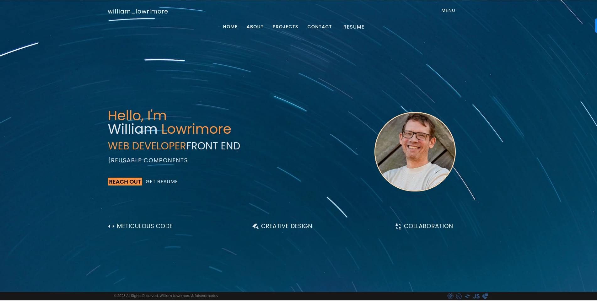
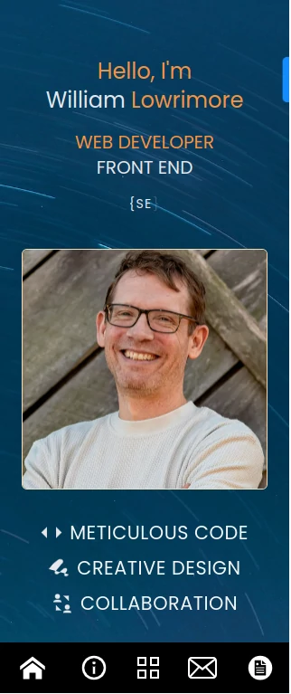

# William Lowrimore | Front End Engineer | Nashville, TN

Hello, and welcome to my portfolio.  In this digital document, you will find most of what you should know about me and my engineering qualifications.  Keep in mind that this portfolio is a summary of my work and studies over the past 2 years.  Some projects either did not make the cut, or they are projects that are privately owned by larger ( some enterprise ) companies and are not available to the public.  
I am always creating and coding, and this site will update with every new project I push to this repository.  So, please feel free to check back for the latest additions.

Have a look at my code here on github and be sure to visit the working portfolio on my website: [www.williamlowrimore.com](https://www.williamlowrimore.com). Thanks for visiting!

 

 
 

 

## Contact Information

[wlowrimore@gmail.com](mailto://wlowrimore@gmail.com) 
[www.linkedin.com](https://www.linkedin.com/in/william-lowrimore-dev) 
[www.fakenamedev@gmail.com](mailto://fakenamedev@gmail.com)  

## Technologies Used for This Portfolio

  

    
    
REACT

  

  

    
    
NEXTJS

  

  

    
    
TAILWIND

  

  

    
    
JAVASCRIPT

  

  

  
  
EMAILJS

  

&copy; Copyright 2023 William Lowrimore | fakenamedev. All Rights Reserved