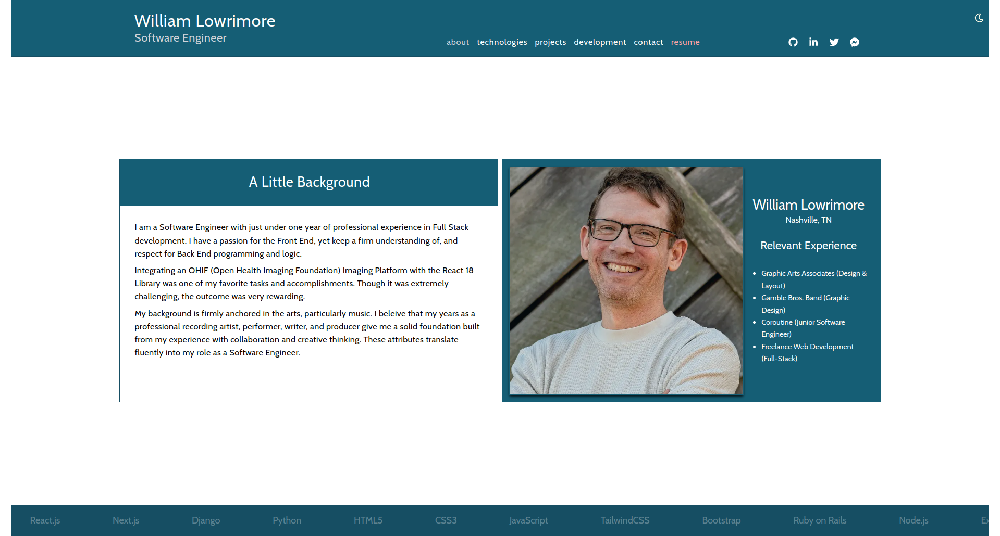
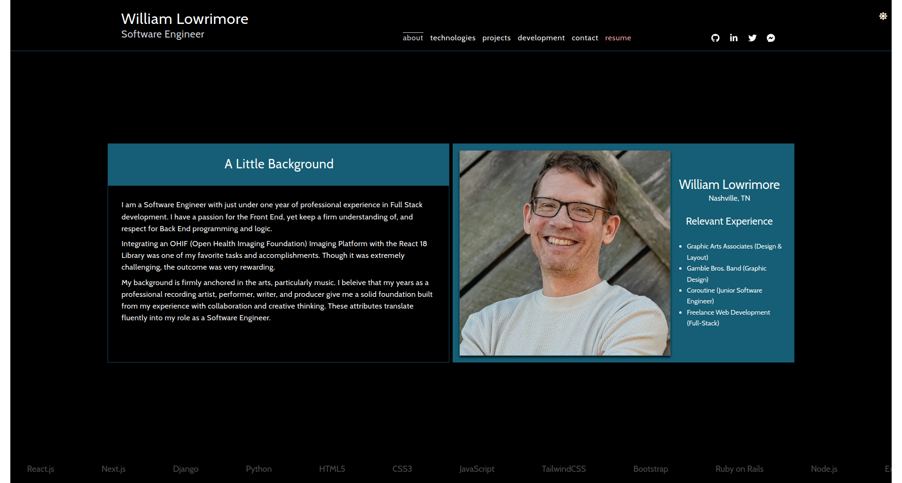

# William Lowrimore | Software Engineer | Nashville, TN

Hello, and welcome to my portfolio.  In this digital document, you will find most of what you should know about me and my engineering qualifications.  Keep in mind that this portfolio is a summary of my work and studies over the past 2 years.  Some projects either did not make the cut, or they are projects that are privately owned by larger ( some enterprise ) companies and are not available to the public. 

Have a look at my code here on github and be sure to visit the working portfolio on my website: [www.williamlowrimore.com](https://www.williamlowrimore.com). Thanks for visiting!

 

 
 

 

## Contact Information

[wlowrimore@gmail.com](mailto://wlowrimore@gmail.com) 
[www.linkedin.com](https://www.linkedin.com/in/william-lowrimore-dev) 
[www.fakenamedev@gmail.com](mailto://fakenamedev@gmail.com)  

## Technologies Used for This Portfolio

React  
React Hooks  
React Icons  
React Fast Marquee 
Next.js 
Tailwind CSS 
Vanilla CSS 
VS Code 
NPM & Yarn  

&copy; Copyright 2023 William Lowrimore | Fake Name Development. All Rights Reserved